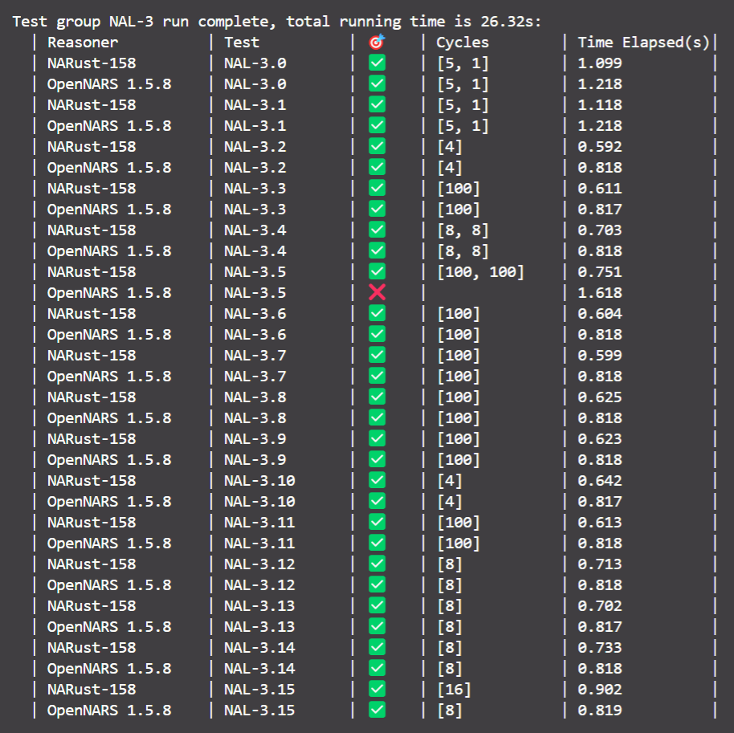
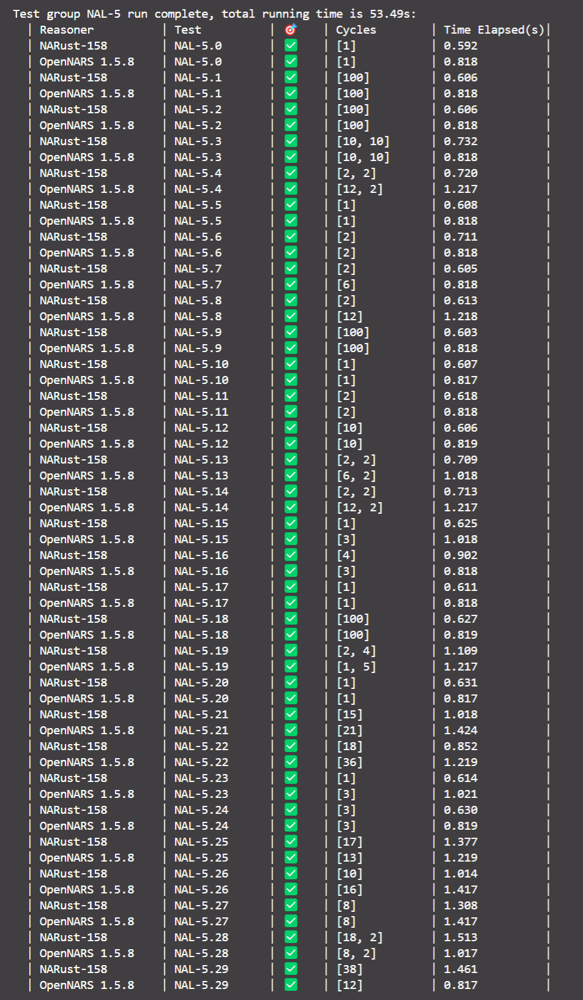

# NARust 158

**Simplified Chinese** | [English](README.en.md)

🕒Last Updated: 2024-08-19

## Introduction


<div align="center">
    
    
    
    
</div>

A [Non-Axiomatic Reasoning System](http://www.opennars.org/) implemented in [Rust](https://www.rust-lang.org/), based on [OpenNARS 1.5.8](https://github.com/patham9/opennars_declarative_core).

## Online Demo

Thanks to the integration of Rust and WebAssembly, this reasoning system has a [web version](https://arcj137442.github.io/demo-158-dev/) and can be run directly in browsers that support WebAssembly.

(Browsers that support WebAssembly: Chrome 57+, EDGE 16+, Safari 11+, Firefox 52+, Opera 44+, ...)

If you want to compile it to the web by yourself, you can refer to the [RustWasm](https://rustwasm.github.io/) and the [`wasm-pack`](https://rustwasm.github.io/wasm-pack/) tool, and you can search for related resources by yourself.

## Quick Start

### Prerequisites

1. Install the [**Rust**](https://www.rust-lang.org/tools/install) compiler toolchain in the system
2. Ensure that the `cargo` command is available after installation


### Try It: Run Immediately

In an **online** environment, run the following command directly:

```bash
cargo install narust-158
```

As of today (2024-08-19), this command will install the following two binaries in the system:

- `narust_158_shell`: Convenient for user interaction, allowing direct input of Narsese statements and values (specify the reasoning cycle step period)
- `narust_158_batch`: Convenient for external integration, unified input of NAVM commands, and input of fixed single-line JSON text format

### Advanced: Source Code Compilation

#### Get the Source Code

You can get the source code directly from the project repository on GitHub:

```bash
git clone https://github.com/arcj137442/narust-158.git
```

You should expect the following reaction: Git fetches the source code from the GitHub repository and downloads it into a specific directory called `narust-158`.

After the project is published to **crates.io**, you can get it in the Rust project directory with the following command:

```bash
cargo add narust-158
```

#### Local Compilation

The source code obtained from GitHub can be built by entering the following command in the command line at the root directory of `narust-158`:

```bash
cargo build
```

You should expect Cargo to automatically download compilation dependencies and ultimately complete the compilation of the project binary files:

```bash
[...]> cargo build
   Compiling narust-158 vX.X.X ([...])
    Finished dev [unoptimized + debuginfo] target(s) in X.XXs
```

#### Build and Run

At this point, you can use the command `cargo run` to run the built binary files:

```bash
cargo run --bin narust_158_shell
```

or

```bash
cargo run --bin narust_158_batch
```

Expect: The command line cursor opens a new line and waits for user input.

After entering the following NAVM command,

```navm-cmd
nse <A --> B>.
nse <B --> C>.
nse <A --> C>?
cyc 20
```

Expect the following output:

```plaintext
nse <A --> B>.
[IN] $0.8000;0.8000;0.9500$ <A --> B>. %1.0000;0.9000%
nse <B --> C>.
[IN] $0.8000;0.8000;0.9500$ <B --> C>. %1.0000;0.9000%
nse <A --> C>?
[IN] $0.9000;0.9000;1.0000$ <A --> C>?
cyc 20
[ANSWER] <A --> C>. %1.0000;0.8100%
```

(↑In `shell`)

```plaintext
nse <A --> B>.
{"type":"IN","content":"In: $0.80;0.80;0.95$ (A --> B). %1.00;0.90%","narsese":"$0.8000;0.8000;0.9500$ <A --> B>. %1.0000;0.9000%"}
nse <B --> C>.
{"type":"IN","content":"In: $0.80;0.80;0.95$ (B --> C). %1.00;0.90%","narsese":"$0.8000;0.8000;0.9500$ <B --> C>. %1.0000;0.9000%"}
nse <A --> C>?
{"type":"IN","content":"In: $0.90;0.90;1.00$ (A --> C)?","narsese":"$0.9000;0.9000;1.0000$ <A --> C>?"}
cyc 20
{"type":"ANSWER","content":"Answer: (A --> C). %1.0000;0.8100%{16 : 2;1}","narsese":"<A --> C>. %1.0000;0.8100%"}
```

(↑In `batch`)

## Project Overview

### Declaration

Regarding the meaning of the term 'OpenNARS': Unless specifically distinguished, it refers by default to [`OpenNARS 1.5.8`](https://github.com/patham9/opennars_declarative_core), and also refer to the individual's [Chinese Notes Appendix Custom Edition](https://github.com/ARCJ137442/OpenNARS-158-dev).

- 📌The project structure is mainly based on the 'Chinese Notes Appendix Custom Edition' (hereinafter referred to as 'Revised OpenNARS').
- ⚠️Comments and notes in the project are all written in Chinese.

### System Module Architecture

The main directory structure of the entire system is as follows:

```plaintext
narust-158
├── docs
├── src
│   ├── bin:        Executable compilation entry
│   ├── control:    Control mechanism
│   ├── entity:     Entity structure
│   ├── inference:  Inference mechanism
│   ├── language:   Knowledge representation language
│   ├── util:       Internal utility functions
│   ├── vm:         Virtual machine interface and built-in implementation
│   ├── global.rs:  Global parameters
│   ├── lib.rs:     Library compilation entry
│   ├── symbols.rs: Global symbol constants, corresponding to OpenNARS `nars.io.Symbols`
│   └── ...
├── Cargo.toml
└── ...
```

#### Knowledge Representation Language

Language module `src/language`: Definitions and processing logic related to 'terms'

```plaintext
language
├── term_impl: Concrete implementation of term structure
│   ├── base: Basic functionality
│   │   ├── construct.rs:  Constructors
│   │   ├── conversion.rs: Type conversion
│   │   ├── property.rs:   Properties
│   │   ├── serde.rs:      Serialization and deserialization
│   │   ├── structs.rs:    Struct definitions
│   │   └── ...
│   ├── dialect: Dialect syntax
│   │   ├── mod.rs:              Dialect parser
│   │   └── narust_dialect.pest: Syntax definition
│   ├── features: Corresponding to OpenNARS features
│   │   ├── compound_term.rs: Corresponding to OpenNARS class `CompoundTerm`
│   │   ├── image.rs:         Corresponding to OpenNARS class `Image`
│   │   ├── statement.rs:     Corresponding to OpenNARS class `Statement`
│   │   ├── term.rs:          Corresponding to OpenNARS class `Term`
│   │   ├── variable.rs:      Corresponding to OpenNARS class `Variable`
│   │   └── ...
│   ├── term_making.rs:      Corresponding to OpenNARS `MakeTerm.java`
│   ├── variable_process.rs: Corresponding to OpenNARS `VariableProcess.java`
│   └── ...
└── ...
```

Entity module `src/entity`: Definitions of structures such as 'truth value', 'budget value', 'statement', 'term chain & task chain', 'concept', 'timestamp', 'task', etc.

```plaintext
entity
├── float_values: 'Floating point values' used by both the language mechanism and the control mechanism
│   ├── budget_value.rs: Budget value
│   ├── truth_value.rs:  Truth value
│   ├── short_float.rs:  Short floating point (four decimal places)
│   └── ...
├── sentence: Language mechanism definitions related to 'statements'
│   ├── impls:             Initial implementation (statements, judgments, questions)
│   ├── judgement.rs:     Unified 'judgment' interface
│   ├── punctuation.rs:   Based on enumeration 'punctuation' definition
│   ├── question.rs:      Unified 'question' interface
│   ├── sentence_trait.rs: Unified 'sentence' interface
│   └── ...
├── linkages: Control mechanism definitions related to 'linkages'
│   ├── t_link.rs:             Unified 'link' interface
│   ├── t_linkage.rs:          General 'linkage' structure
│   ├── task_link.rs:          Task chain
│   ├── term_link_template.rs: Term link template
│   ├── term_link.rs:          Term link
│   └── ...
├── concept.rs: Control mechanism structure 'concept'
├── item.rs:    Control mechanism interface 'item'
├── stamp.rs:   Language mechanism structure 'timestamp'
├── task.rs:    Control mechanism structure 'task'
└── ...
```

(This structure originates from OpenNARS 1.5.8, and the code has not been completely separated in terms of inference and control mechanisms)

#### Inference Control Mechanism

NARS Storage Container `src/storage`: Storage container related to "entities"

```plaintext
storage
├── bag: Basic container "bag" based on the control mechanism of "pseudo-random priority queue"
│   ├── distributor.rs: Pseudo-random distributor based on priority with a triangular distribution
│   ├── impl_tables.rs: Auxiliary "name table" and "level table" structures
│   ├── impl_v1.rs:     The final exported "first generation implementation"
│   └── ...
├── buffer.rs:     "Buffer" structure used in "concepts"
├── memory.rs:     Overall container "memory area" for storing "concepts"
├── rank_table.rs: "Ranking table" structure used in "concepts"
└── ...
```

NARS Inference Function `src/inference`: The process of handling various "entities" in the "container" based on NAL and "knowledge representation language" mechanism

```plaintext
inference
├── engine: Universal "inference engine" interface
│   ├── inference_engine.rs: Definition and interface of the inference engine
│   └── ...
├── functions: Truth functions, budget functions, etc.
│   ├── budget_functions.rs:  Code related to "budget functions" in NAL, corresponding to `nars.inference.BudgetFunctions`
│   ├── truth_functions.rs:   "Truth functions" in NAL, corresponding to `nars.inference.TruthFunctions`
│   ├── utility_functions.rs: Code related to "extended logical operations" in NAL, corresponding to `nars.inference.UtilityFunctions`
│   └── ...
├── rules: Specific NAL inference rules
│   ├── table: Rule dispatch table
│   │   ├── entry.rs:         Rule dispatch entry, corresponding to `nars.inference.RuleTables`
│   │   ├── syllogistic.rs:   Dispatch related to "syllogistic rules"
│   │   ├── compositional.rs: Dispatch related to "compositional rules"
│   │   └── ...
│   ├── compositional_rules.rs: Compositional rules, corresponding to `nars.inference.CompositionalRules`
│   ├── local_rules.rs:         Local rules, corresponding to `nars.inference.LocalRules`
│   ├── matching_rules.rs:      Matching rules, corresponding to `nars.inference.MatchingRules`
│   ├── structural_rules.rs:    Structural rules, corresponding to `nars.inference.StructuralRules`
│   ├── syllogistic_rules.rs:   Syllogistic rules, corresponding to `nars.inference.SyllogisticRules`
│   ├── transform_rules.rs:     Transformation rules, corresponding to `nars.inference.TransformRules`
│   └── ...
├── traits
│   ├── budget.rs:     Abstract interface related to "budget", shared by "budget value", "task", "concept", etc.
│   ├── evidential.rs: Abstract interface related to "evidence base", shared by "timestamp", "statement", "task", etc.
│   ├── truth.rs:      Abstract interface related to "truth", shared by "truth value", "judgment", etc.
│   └── ...
├── budget_inference.rs: "Budget inference" involving "link feedback"
├── local_inference.rs:  "Direct inference" involving "belief revision" and "question answering"
└── ...
```

NARS Control Mechanism `src/control`: Functions closely related to the "reasoner" on top of "containers" and "inference rules"

```plaintext
control
├── context: "Inference context" function in the control mechanism
│   ├── context_concept.rs:   Concept inference context
│   ├── context_direct.rs:    Direct inference context
│   ├── context_transform.rs: Transformation inference context
│   ├── derivation.rs:        Related functions of inference derivation
│   ├── reason_context.rs:    Unified "inference context" interface
│   └── ...
├── process: Runtime functions related to "work cycle"
│   ├── concept_linking.rs: Concept linking (building task chains, word chains)
│   ├── parsing_task.rs:    Narsese task parsing function
│   ├── process_direct.rs:  Control process involving "direct inference"
│   ├── process_reason.rs:  Control process involving "concept inference"
│   ├── work_cycle.rs:      Work cycle control
│   └── ...
├── reasoner: The definition of the reasoner itself and its external API
│   ├── definition.rs:       Data structure definition of the reasoner
│   ├── derivation_datas.rs: Accessory data structures, including "New Task Queue" and "Novel Task Bag"
│   ├── report.rs:           Output report function
│   ├── serde.rs:            Serialization and deserialization function
│   ├── vm_api.rs:           NAVM virtual machine API
│   └── ...
├── parameters.rs: Hyper-parameters of the reasoner
└── ...
```

#### External Application Interface

NAVM Virtual Machine Self-implemented Implementation `src/vm`: Provides a self-implemented NAVM implementation based on the "reasoner" and NAVM API

```plaintext
vm
├── alpha: Self-contained kernel "Alpha" of the virtual machine
│   ├── cmd_dispatch: NAVM instruction dispatch
│   │   ├── cmd_hlp.rs: Handling instruction `HLP`
│   │   ├── cmd_inf.rs: Handling instruction `INF`
│   │   ├── cmd_loa.rs: Handling instruction `LOA`
│   │   ├── cmd_sav.rs: Handling instruction `SAV`
│   │   └── mod.rs: Top-level dispatch function
│   ├── io: Input and output at the virtual machine level, corresponding to the original OpenNARS channel mechanism
│   │   ├── _channel.rs:       Abstract traits related to "channels"
│   │   ├── channel_in.rs:     Preliminary implementation of input channels
│   │   ├── channel_out.rs:    Preliminary implementation of output channels
│   │   ├── channels.rs:       Managing input and output channels on top of the reasoner
│   │   ├── handle_io.rs:      Actual logic of channel input and output
│   │   ├── input_channel.rs:  Abstract traits of input channels
│   │   ├── output_channel.rs: Abstract traits of output channels
│   │   └── ...
│   ├── launcher.rs: Virtual machine launcher
│   ├── runtime.rs:  Virtual machine runtime
│   └── ...
└── ...
```

### Functionality Test Comparison

🕒Last Updated: 【2024-08-19 23:56:58】

🔗Reference: [BabelNAR NAL Test Suite (Chinese)](https://github.com/ARCJ137442/BabelNAR-NAL-test-suite)

📄The latest test results can be found in the [csv file](./docs/test_results/group_result-20240820000245.csv)

Below is a comparison of the test results between **NARust-158** and **OpenNARS 1.5.8**:

#### NAL-1


#### NAL-2


#### NAL-3



#### NAL-4


#### NAL-5



#### NAL-6


#### Total Table

|Serial|Test group|Reasoner|Test|🎯|Cycles|Time Elapsed(s)|
|:-|:-|:-|:-|:-|:-|:-|
|1|NAL-1|NARust-158|NAL-1.0|✅|1|0.5954129695892334|
|2|NAL-1|OpenNARS 1.5.8|NAL-1.0|✅|1|0.8183493614196777|
|3|NAL-1|NARust-158|NAL-1.1|✅|5|0.9925639629364014|
|4|NAL-1|OpenNARS 1.5.8|NAL-1.1|✅|5|1.0172924995422363|
|5|NAL-1|NARust-158|NAL-1.2|✅|5 + 1|1.1002004146575928|
|6|NAL-1|OpenNARS 1.5.8|NAL-1.2|✅|5 + 1|1.218430757522583|
|7|NAL-1|NARust-158|NAL-1.3|✅|5 + 1|1.102980375289917|
|8|NAL-1|OpenNARS 1.5.8|NAL-1.3|✅|5 + 1|1.2181055545806885|
|9|NAL-1|NARust-158|NAL-1.4|✅|5|1.0003728866577148|
|10|NAL-1|OpenNARS 1.5.8|NAL-1.4|✅|5|1.018073558807373|
|11|NAL-1|NARust-158|NAL-1.5|✅|3|0.7906851768493652|
|12|NAL-1|OpenNARS 1.5.8|NAL-1.5|✅|5|1.0184855461120605|
|13|NAL-1|NARust-158|NAL-1.6|✅|1|0.5974311828613281|
|14|NAL-1|OpenNARS 1.5.8|NAL-1.6|✅|1|0.8184366226196289|
|15|NAL-1|NARust-158|NAL-1.7|✅|2|0.7023866176605225|
|16|NAL-1|OpenNARS 1.5.8|NAL-1.7|✅|1|0.8166286945343018|
|17|NAL-1|NARust-158|NAL-1.8|✅|2 + 1|0.8164653778076172|
|18|NAL-1|OpenNARS 1.5.8|NAL-1.8|✅|1 + 1|0.8180663585662842|
|19|NAL-2|NARust-158|NAL-2.0|✅|1|0.5882105827331543|
|20|NAL-2|OpenNARS 1.5.8|NAL-2.0|✅|1|0.8178684711456299|
|21|NAL-2|NARust-158|NAL-2.1|✅|5|1.0131173133850098|
|22|NAL-2|OpenNARS 1.5.8|NAL-2.1|✅|5|1.0181186199188232|
|23|NAL-2|NARust-158|NAL-2.2|✅|2|0.6862974166870117|
|24|NAL-2|OpenNARS 1.5.8|NAL-2.2|✅|7|1.2179877758026123|
|25|NAL-2|NARust-158|NAL-2.3|✅|5|0.9923756122589111|
|26|NAL-2|OpenNARS 1.5.8|NAL-2.3|✅|5|1.0192923545837402|
|27|NAL-2|NARust-158|NAL-2.4|✅|5|1.0161314010620117|
|28|NAL-2|OpenNARS 1.5.8|NAL-2.4|✅|5|1.0183181762695312|
|29|NAL-2|NARust-158|NAL-2.5|✅|5|0.9920682907104492|
|30|NAL-2|OpenNARS 1.5.8|NAL-2.5|✅|5|1.0166361331939697|
|31|NAL-2|NARust-158|NAL-2.6|✅|5|0.9971611499786377|
|32|NAL-2|OpenNARS 1.5.8|NAL-2.6|✅|5|1.0190651416778564|
|33|NAL-2|NARust-158|NAL-2.7|✅|5|0.9988064765930176|
|34|NAL-2|OpenNARS 1.5.8|NAL-2.7|✅|3|0.8180522918701172|
|35|NAL-2|NARust-158|NAL-2.8|✅|20|0.5948235988616943|
|36|NAL-2|OpenNARS 1.5.8|NAL-2.8|✅|20|0.8179733753204346|
|37|NAL-2|NARust-158|NAL-2.9|✅|5|1.0015182495117188|
|38|NAL-2|OpenNARS 1.5.8|NAL-2.9|✅|3|0.8180046081542969|
|39|NAL-2|NARust-158|NAL-2.10|✅|8|0.5884933471679688|
|40|NAL-2|OpenNARS 1.5.8|NAL-2.10|✅|8|0.8187534809112549|
|41|NAL-2|NARust-158|NAL-2.11|✅|4|0.6898593902587891|
|42|NAL-2|OpenNARS 1.5.8|NAL-2.11|✅|6|0.8177580833435059|
|43|NAL-2|NARust-158|NAL-2.12|✅|4|0.8919978141784668|
|44|NAL-2|OpenNARS 1.5.8|NAL-2.12|✅|6|1.2169487476348877|
|45|NAL-2|NARust-158|NAL-2.13|✅|1|0.5938620567321777|
|46|NAL-2|OpenNARS 1.5.8|NAL-2.13|✅|1|0.8183119297027588|
|47|NAL-2|NARust-158|NAL-2.14|✅|1|0.596996545791626|
|48|NAL-2|OpenNARS 1.5.8|NAL-2.14|✅|1|0.81703782081604|
|49|NAL-2|NARust-158|NAL-2.15|✅|1|0.5949504375457764|
|50|NAL-2|OpenNARS 1.5.8|NAL-2.15|✅|1|0.8177728652954102|
|51|NAL-2|NARust-158|NAL-2.16|✅|6|0.7998340129852295|
|52|NAL-2|OpenNARS 1.5.8|NAL-2.16|✅|10|1.0184473991394043|
|53|NAL-2|NARust-158|NAL-2.17|✅|5|0.99479079246521|
|54|NAL-2|OpenNARS 1.5.8|NAL-2.17|✅|7|1.2191729545593262|
|55|NAL-2|NARust-158|NAL-2.18|✅|5 + 1|1.101579189300537|
|56|NAL-2|OpenNARS 1.5.8|NAL-2.18|✅|7 + 1|1.4188337326049805|
|57|NAL-2|NARust-158|NAL-2.19|✅|5 + 1|1.110304355621338|
|58|NAL-2|OpenNARS 1.5.8|NAL-2.19|✅|7 + 1|1.4179441928863525|
|59|NAL-3|NARust-158|NAL-3.0|✅|5 + 1|1.0987911224365234|
|60|NAL-3|OpenNARS 1.5.8|NAL-3.0|✅|5 + 1|1.218343734741211|
|61|NAL-3|NARust-158|NAL-3.1|✅|5 + 1|1.1182663440704346|
|62|NAL-3|OpenNARS 1.5.8|NAL-3.1|✅|5 + 1|1.2175726890563965|
|63|NAL-3|NARust-158|NAL-3.2|✅|4|0.592303991317749|
|64|NAL-3|OpenNARS 1.5.8|NAL-3.2|✅|4|0.8178369998931885|
|65|NAL-3|NARust-158|NAL-3.3|✅|100|0.6109724044799805|
|66|NAL-3|OpenNARS 1.5.8|NAL-3.3|✅|100|0.8171384334564209|
|67|NAL-3|NARust-158|NAL-3.4|✅|8 + 8|0.7029902935028076|
|68|NAL-3|OpenNARS 1.5.8|NAL-3.4|✅|8 + 8|0.817694902420044|
|69|NAL-3|NARust-158|NAL-3.5|✅|100 + 100|0.7507014274597168|
|70|NAL-3|OpenNARS 1.5.8|NAL-3.5|❌||1.6182081699371338|
|71|NAL-3|NARust-158|NAL-3.6|✅|100|0.6037416458129883|
|72|NAL-3|OpenNARS 1.5.8|NAL-3.6|✅|100|0.8177168369293213|
|73|NAL-3|NARust-158|NAL-3.7|✅|100|0.5986242294311523|
|74|NAL-3|OpenNARS 1.5.8|NAL-3.7|✅|100|0.818411111831665|
|75|NAL-3|NARust-158|NAL-3.8|✅|100|0.6246905326843262|
|76|NAL-3|OpenNARS 1.5.8|NAL-3.8|✅|100|0.8179376125335693|
|77|NAL-3|NARust-158|NAL-3.9|✅|100|0.6234555244445801|
|78|NAL-3|OpenNARS 1.5.8|NAL-3.9|✅|100|0.8179781436920166|
|79|NAL-3|NARust-158|NAL-3.10|✅|4|0.642333984375|
|80|NAL-3|OpenNARS 1.5.8|NAL-3.10|✅|4|0.8172469139099121|
|81|NAL-3|NARust-158|NAL-3.11|✅|100|0.613426685333252|
|82|NAL-3|OpenNARS 1.5.8|NAL-3.11|✅|100|0.8180327415466309|
|83|NAL-3|NARust-158|NAL-3.12|✅|8|0.7130308151245117|
|84|NAL-3|OpenNARS 1.5.8|NAL-3.12|✅|8|0.8176462650299072|
|85|NAL-3|NARust-158|NAL-3.13|✅|8|0.7020564079284668|
|86|NAL-3|OpenNARS 1.5.8|NAL-3.13|✅|8|0.8171148300170898|
|87|NAL-3|NARust-158|NAL-3.14|✅|8|0.7334625720977783|
|88|NAL-3|OpenNARS 1.5.8|NAL-3.14|✅|8|0.8183391094207764|
|89|NAL-3|NARust-158|NAL-3.15|✅|16|0.9022154808044434|
|90|NAL-3|OpenNARS 1.5.8|NAL-3.15|✅|8|0.8185086250305176|
|91|NAL-4|NARust-158|NAL-4.0|✅|9 + 1|1.3645102977752686|
|92|NAL-4|OpenNARS 1.5.8|NAL-4.0|✅|8 + 1|1.6192405223846436|
|93|NAL-4|NARust-158|NAL-4.1|✅|10 + 1|1.459580421447754|
|94|NAL-4|OpenNARS 1.5.8|NAL-4.1|✅|9 + 1|1.4185864925384521|
|95|NAL-4|NARust-158|NAL-4.2|✅|10 + 1|1.4524781703948975|
|96|NAL-4|OpenNARS 1.5.8|NAL-4.2|✅|9 + 1|1.4183306694030762|
|97|NAL-4|NARust-158|NAL-4.3|✅|10 + 1|1.4990899562835693|
|98|NAL-4|OpenNARS 1.5.8|NAL-4.3|✅|9 + 1|1.6195216178894043|
|99|NAL-4|NARust-158|NAL-4.4|✅|9 + 1|1.3599236011505127|
|100|NAL-4|OpenNARS 1.5.8|NAL-4.4|✅|8 + 1|1.419097900390625|
|101|NAL-4|NARust-158|NAL-4.5|✅|9 + 1|1.3632681369781494|
|102|NAL-4|OpenNARS 1.5.8|NAL-4.5|✅|8 + 1|1.4237298965454102|
|103|NAL-4|NARust-158|NAL-4.6|✅|30|0.6576845645904541|
|104|NAL-4|OpenNARS 1.5.8|NAL-4.6|✅|20|0.8183119297027588|
|105|NAL-4|NARust-158|NAL-4.7|✅|30|0.6930375099182129|
|106|NAL-4|OpenNARS 1.5.8|NAL-4.7|✅|20|0.8178501129150391|
|107|NAL-4|NARust-158|NAL-4.8|✅|30|0.6398265361785889|
|108|NAL-4|OpenNARS 1.5.8|NAL-4.8|✅|30|0.8178706169128418|
|109|NAL-5|NARust-158|NAL-5.0|✅|1|0.5923786163330078|
|110|NAL-5|OpenNARS 1.5.8|NAL-5.0|✅|1|0.8178191184997559|
|111|NAL-5|NARust-158|NAL-5.1|✅|100|0.6058564186096191|
|112|NAL-5|OpenNARS 1.5.8|NAL-5.1|✅|100|0.8180820941925049|
|113|NAL-5|NARust-158|NAL-5.2|✅|100|0.6055483818054199|
|114|NAL-5|OpenNARS 1.5.8|NAL-5.2|✅|100|0.817556619644165|
|115|NAL-5|NARust-158|NAL-5.3|✅|10 + 10|0.731611967086792|
|116|NAL-5|OpenNARS 1.5.8|NAL-5.3|✅|10 + 10|0.8183648586273193|
|117|NAL-5|NARust-158|NAL-5.4|✅|2 + 2|0.71968674659729|
|118|NAL-5|OpenNARS 1.5.8|NAL-5.4|✅|12 + 2|1.217257022857666|
|119|NAL-5|NARust-158|NAL-5.5|✅|1|0.608281135559082|
|120|NAL-5|OpenNARS 1.5.8|NAL-5.5|✅|1|0.8177833557128906|
|121|NAL-5|NARust-158|NAL-5.6|✅|2|0.7111854553222656|
|122|NAL-5|OpenNARS 1.5.8|NAL-5.6|✅|2|0.8177797794342041|
|123|NAL-5|NARust-158|NAL-5.7|✅|2|0.6048617362976074|
|124|NAL-5|OpenNARS 1.5.8|NAL-5.7|✅|6|0.8176219463348389|
|125|NAL-5|NARust-158|NAL-5.8|✅|2|0.613330602645874|
|126|NAL-5|OpenNARS 1.5.8|NAL-5.8|✅|12|1.2176799774169922|
|127|NAL-5|NARust-158|NAL-5.9|✅|100|0.6031229496002197|
|128|NAL-5|OpenNARS 1.5.8|NAL-5.9|✅|100|0.818305492401123|
|129|NAL-5|NARust-158|NAL-5.10|✅|1|0.6073472499847412|
|130|NAL-5|OpenNARS 1.5.8|NAL-5.10|✅|1|0.8171191215515137|
|131|NAL-5|NARust-158|NAL-5.11|✅|2|0.6179885864257812|
|132|NAL-5|OpenNARS 1.5.8|NAL-5.11|✅|2|0.8184006214141846|
|133|NAL-5|NARust-158|NAL-5.12|✅|10|0.6061127185821533|
|134|NAL-5|OpenNARS 1.5.8|NAL-5.12|✅|10|0.81870436668396|
|135|NAL-5|NARust-158|NAL-5.13|✅|2 + 2|0.7091310024261475|
|136|NAL-5|OpenNARS 1.5.8|NAL-5.13|✅|6 + 2|1.0179312229156494|
|137|NAL-5|NARust-158|NAL-5.14|✅|2 + 2|0.7129168510437012|
|138|NAL-5|OpenNARS 1.5.8|NAL-5.14|✅|12 + 2|1.2173380851745605|
|139|NAL-5|NARust-158|NAL-5.15|✅|1|0.6248800754547119|
|140|NAL-5|OpenNARS 1.5.8|NAL-5.15|✅|3|1.0182271003723145|
|141|NAL-5|NARust-158|NAL-5.16|✅|4|0.9017784595489502|
|142|NAL-5|OpenNARS 1.5.8|NAL-5.16|✅|3|0.8178815841674805|
|143|NAL-5|NARust-158|NAL-5.17|✅|1|0.6106598377227783|
|144|NAL-5|OpenNARS 1.5.8|NAL-5.17|✅|1|0.8181400299072266|
|145|NAL-5|NARust-158|NAL-5.18|✅|100|0.6270186901092529|
|146|NAL-5|OpenNARS 1.5.8|NAL-5.18|✅|100|0.8192980289459229|
|147|NAL-5|NARust-158|NAL-5.19|✅|2 + 4|1.1093814373016357|
|148|NAL-5|OpenNARS 1.5.8|NAL-5.19|✅|1 + 5|1.2171788215637207|
|149|NAL-5|NARust-158|NAL-5.20|✅|1|0.6312530040740967|
|150|NAL-5|OpenNARS 1.5.8|NAL-5.20|✅|1|0.8166608810424805|
|151|NAL-5|NARust-158|NAL-5.21|✅|15|1.0181469917297363|
|152|NAL-5|OpenNARS 1.5.8|NAL-5.21|✅|21|1.4238536357879639|
|153|NAL-5|NARust-158|NAL-5.22|✅|18|0.8522002696990967|
|154|NAL-5|OpenNARS 1.5.8|NAL-5.22|✅|36|1.2188985347747803|
|155|NAL-5|NARust-158|NAL-5.23|✅|1|0.6137230396270752|
|156|NAL-5|OpenNARS 1.5.8|NAL-5.23|✅|3|1.0210330486297607|
|157|NAL-5|NARust-158|NAL-5.24|✅|3|0.6303892135620117|
|158|NAL-5|OpenNARS 1.5.8|NAL-5.24|✅|3|0.8188819885253906|
|159|NAL-5|NARust-158|NAL-5.25|✅|17|1.3772735595703125|
|160|NAL-5|OpenNARS 1.5.8|NAL-5.25|✅|13|1.218663215637207|
|161|NAL-5|NARust-158|NAL-5.26|✅|10|1.014359712600708|
|162|NAL-5|OpenNARS 1.5.8|NAL-5.26|✅|16|1.417463779449463|
|163|NAL-5|NARust-158|NAL-5.27|✅|8|1.30757737159729|
|164|NAL-5|OpenNARS 1.5.8|NAL-5.27|✅|8|1.4172580242156982|
|165|NAL-5|NARust-158|NAL-5.28|✅|18 + 2|1.513357162475586|
|166|NAL-5|OpenNARS 1.5.8|NAL-5.28|✅|8 + 2|1.01711106300354|
|167|NAL-5|NARust-158|NAL-5.29|✅|38|1.4606080055236816|
|168|NAL-5|OpenNARS 1.5.8|NAL-5.29|✅|12|0.8172476291656494|
|169|NAL-6|NARust-158|NAL-6.0|✅|1|0.6033296585083008|
|170|NAL-6|OpenNARS 1.5.8|NAL-6.0|✅|1|0.8175020217895508|
|171|NAL-6|NARust-158|NAL-6.1|✅|5 + 1|1.1030211448669434|
|172|NAL-6|OpenNARS 1.5.8|NAL-6.1|✅|5 + 1|1.2181439399719238|
|173|NAL-6|NARust-158|NAL-6.2|✅|5 + 1 + 1 + 1 + 1|0.9584789276123047|
|174|NAL-6|OpenNARS 1.5.8|NAL-6.2|✅|5 + 1 + 1 + 1 + 1|1.2184979915618896|
|175|NAL-6|NARust-158|NAL-6.3|✅|5 + 1 + 1 + 1 + 1|1.404578447341919|
|176|NAL-6|OpenNARS 1.5.8|NAL-6.3|✅|5 + 1 + 1 + 1 + 1|1.6175479888916016|
|177|NAL-6|NARust-158|NAL-6.4|✅|1|0.6025612354278564|
|178|NAL-6|OpenNARS 1.5.8|NAL-6.4|✅|3|0.8175523281097412|
|179|NAL-6|NARust-158|NAL-6.5|✅|20 + 2|0.7320339679718018|
|180|NAL-6|OpenNARS 1.5.8|NAL-6.5|✅|20 + 2|0.8189425468444824|
|181|NAL-6|NARust-158|NAL-6.6|✅|8|0.8993208408355713|
|182|NAL-6|OpenNARS 1.5.8|NAL-6.6|✅|4|0.8170242309570312|
|183|NAL-6|NARust-158|NAL-6.7|✅|5|1.0029892921447754|
|184|NAL-6|OpenNARS 1.5.8|NAL-6.7|✅|5|1.017634391784668|
|185|NAL-6|NARust-158|NAL-6.8|✅|5|1.0208451747894287|
|186|NAL-6|OpenNARS 1.5.8|NAL-6.8|✅|5|1.2178993225097656|
|187|NAL-6|NARust-158|NAL-6.9|✅|5|1.0232045650482178|
|188|NAL-6|OpenNARS 1.5.8|NAL-6.9|✅|5|1.0178754329681396|
|189|NAL-6|NARust-158|NAL-6.10|✅|200|0.6589128971099854|
|190|NAL-6|OpenNARS 1.5.8|NAL-6.10|✅|200|0.8186118602752686|
|191|NAL-6|NARust-158|NAL-6.11|✅|3|0.6792869567871094|
|192|NAL-6|OpenNARS 1.5.8|NAL-6.11|✅|6|0.8184347152709961|
|193|NAL-6|NARust-158|NAL-6.12|✅|9|0.8455550670623779|
|194|NAL-6|OpenNARS 1.5.8|NAL-6.12|✅|3|0.8197438716888428|
|195|NAL-6|NARust-158|NAL-6.13|✅|22|1.0612874031066895|
|196|NAL-6|OpenNARS 1.5.8|NAL-6.13|✅|8|0.8168606758117676|
|197|NAL-6|NARust-158|NAL-6.14|✅|3|0.7985975742340088|
|198|NAL-6|OpenNARS 1.5.8|NAL-6.14|✅|2|0.8174269199371338|
|199|NAL-6|NARust-158|NAL-6.15|✅|10|0.603034257888794|
|200|NAL-6|OpenNARS 1.5.8|NAL-6.15|✅|10|0.8172047138214111|
|201|NAL-6|NARust-158|NAL-6.16|✅|10|0.6254706382751465|
|202|NAL-6|OpenNARS 1.5.8|NAL-6.16|✅|5|0.817591667175293|
|203|NAL-6|NARust-158|NAL-6.17|✅|5 + 1 + 1 + 1|1.3186566829681396|
|204|NAL-6|OpenNARS 1.5.8|NAL-6.17|✅|5 + 1 + 1 + 1|1.4196081161499023|
|205|NAL-6|NARust-158|NAL-6.18|✅|5 + 1 + 1 + 1|1.335634708404541|
|206|NAL-6|OpenNARS 1.5.8|NAL-6.18|✅|5 + 1 + 1 + 1|1.4191017150878906|
|207|NAL-6|NARust-158|NAL-6.19|✅|5 + 1|1.119678020477295|
|208|NAL-6|OpenNARS 1.5.8|NAL-6.19|✅|3 + 1|1.0181732177734375|
|209|NAL-6|NARust-158|NAL-6.20|✅|20 + 20|0.7085788249969482|
|210|NAL-6|OpenNARS 1.5.8|NAL-6.20|✅|20 + 20|0.8183784484863281|
|211|NAL-6|NARust-158|NAL-6.21|✅|20 + 20|0.728318452835083|
|212|NAL-6|OpenNARS 1.5.8|NAL-6.21|✅|20 + 20|0.8181295394897461|
|213|NAL-6|NARust-158|NAL-6.22|❌||2.2233645915985107|
|214|NAL-6|OpenNARS 1.5.8|NAL-6.22|❌||1.6211707592010498|
|215|NAL-6|NARust-158|NAL-6.23|❌||1.2589473724365234|
|216|NAL-6|OpenNARS 1.5.8|NAL-6.23|❌||1.6173293590545654|
|217|NAL-6|NARust-158|NAL-6.24|❌||1.2618408203125|
|218|NAL-6|OpenNARS 1.5.8|NAL-6.24|❌||1.6170527935028076|
|219|NAL-6|NARust-158|NAL-6.25|✅|5|1.0037875175476074|
|220|NAL-6|OpenNARS 1.5.8|NAL-6.25|❌||1.6173484325408936|
|221|NAL-6|NARust-158|NAL-6.26|✅|9|1.4338345527648926|
|222|NAL-6|OpenNARS 1.5.8|NAL-6.26|✅|7|1.217932939529419|
|223|NAL-6|NARust-158|NAL-6.27|❌||1.262467622756958|
|224|NAL-6|OpenNARS 1.5.8|NAL-6.27|❌||1.6189584732055664|

### Language Features Used

📝Main Rust language features involved in the code (some of which may be challenging to understand):

- Pattern matching
- Generics (static dispatch)
- Traits (abstract interfaces)
- Closures (for simplifying temporary reusable code)
- Modules
- Macros (declarative macros)

⚠️Features that may be difficult to understand:

- `unsafe` code (mutable references for compound terms)
- Trait objects (dynamic dispatch)

### Potential Application Areas

- Web development: Running NARS in the browser, facilitating the integration of NARS into internet applications
- Embedded systems: Running NARS on embedded devices for small kernel, strong specialization scenarios
- Industrial applications: Running NARS on industrial equipment for high performance, low operational overhead scenarios

## Contribution Guidelines

### Project Branch Status

- `main`: The base version, with long-term support
- `dev`: The development version, under continuous development (ℹ️**PRs are mainly merged into this branch**)
- `dev-XXX`: Derivative branches for learning or experimentation
- `archive-XXX`: Archived branches, providing long-term stable and unchanging code
- `debug-XXX`: Temporary branches for solving problems/bugs

### Ways to Contribute

- [Github Issues](https://github.com/ARCJ137442/Narust-158/issues): Report issues, suggestions, bugs
- [GitHub Pull Request](https://github.com/ARCJ137442/Narust-158/pulls): Contribute code directly to the project

## Engineering Log

### [2024-08-19 00:28:53]

📌 Guiding Principle: **Stabilize the Foundation, Extend the Branches**

1. 📍 Provide an external version close to the **declarative core** (LTS Long-term support)
    - 🏗️ Make a solid contribution to the entire NARS engineering ecosystem
    - 🔦 Provide a cornerstone for future generations (especially Rustaceans) to study NARS in engineering
2. 💡 On the foundation of the 'basic version', given my familiarity with Rust, continue to extend and expand, exploring its unique research and application value
    - 🔬 Research: With my familiarity with the core, explore the direction of NAL 7~9 'event reasoning' and 'process reasoning'
    - 🪛 Application: Leverage the advantages of Rust programs in performance, safety, and integrability to explore its application potential in high-performance industrial production, embedded systems, the internet, and other areas where Rust excels

### [2024-06-14 00:41:48]

📌 Core Principle: **Refactor First, Migrate Next, Then Stand Alone**

1. 💡 First, based on the well-established Java development environment, use 'synonymous refactoring' to make the most of Java's development speed and rapid verification advantages
    - ❗ Refactoring is not terrible, what's terrible is 'migrating halfway and having to start over again'
2. 🚚 Before migrating, clarify and **stabilize** the nullability, mutability, reference sharing, and variable ownership of each class, interface, field, and method in Java
    - 🎯 Strive for 'multiple verifications, one migration, one stability'
3. 🏗️ After migrating to Rust and achieving basic stability, start to align the existing test toolchain, and open source it after **aligning with OpenNARS 1.5.8**
    - 🎯 Publicly post, striving to complete before July
