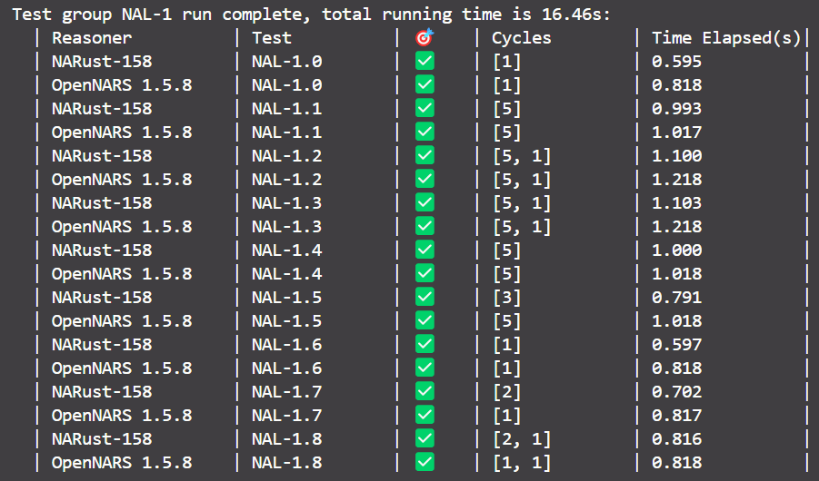
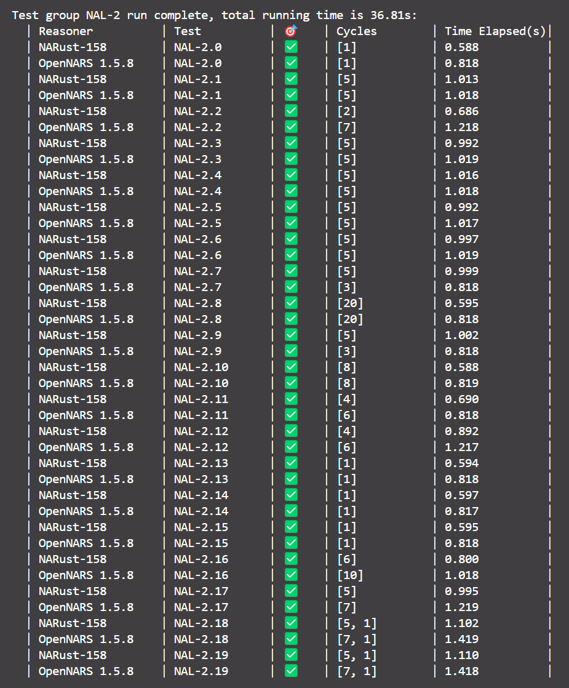
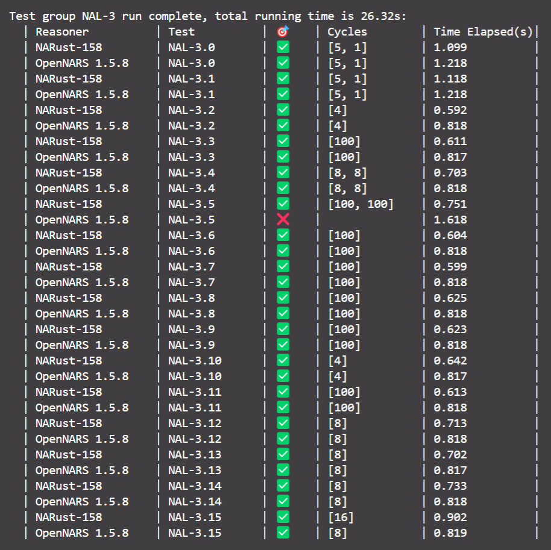
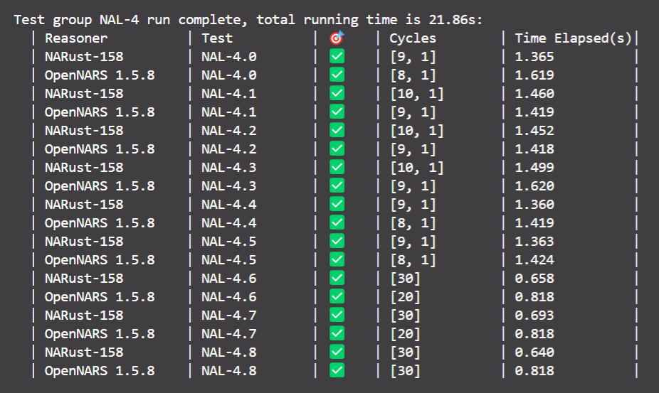
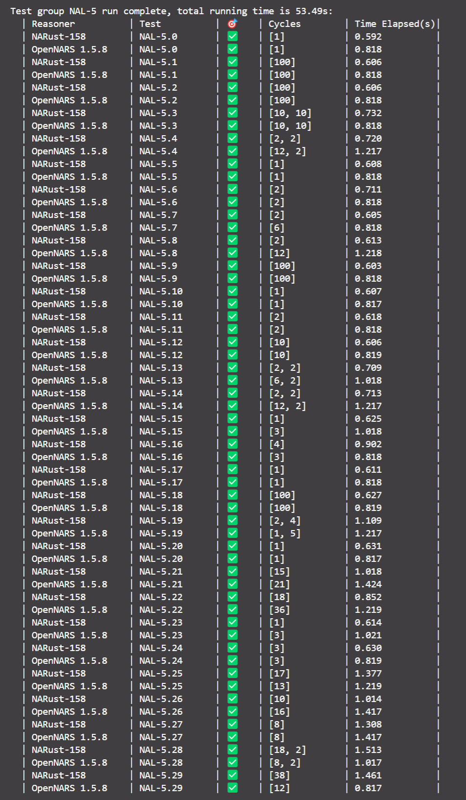
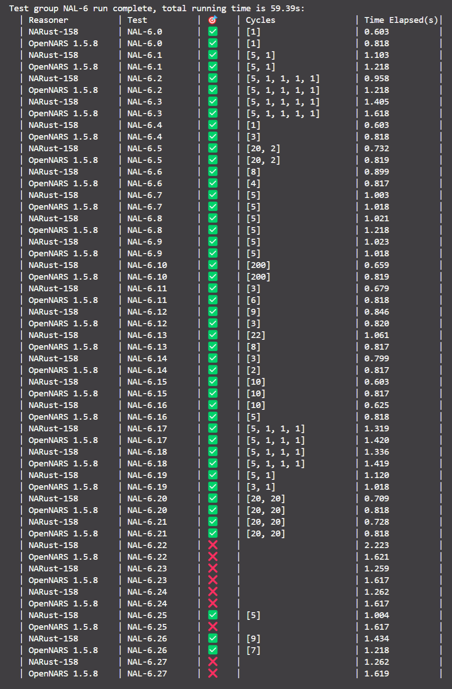

# NARust 158

|**简体中文** | [English](README.en.md)|
|:-:|:-:|

<!-- 📝尺寸参考：<https://stackoverflow.com/questions/14675913/changing-image-size-in-markdown> -->


<!-- 徽章安排参考：https://daily.dev/blog/readme-badges-github-best-practices#organizing-badges-in-your-readme -->


[](https://www.rust-lang.org)

<!-- 面向用户 -->

Cargo状态：

[](https://crates.io/crates/narust_158)
[](https://docs.rs/narust_158)


<!-- 面向开发者 -->

开发状态：

[](https://github.com/ARCJ137442/NARust-158/actions/workflows/ci.yml)
[](https://conventionalcommits.org)


<!--
参考自 https://github.com/ferrumc-rs/ferrumc
颜色 #ff7043 来自logo中的Rust图标
-->

<!-- [](https://star-history.com/#ARCJ137442/NARust-158&Date) --> <!-- ! 暂时不表 -->

## 简介

一个 [非公理推理系统](http://www.opennars.org/) 的 [Rust](https://www.rust-lang.org/) 版本，复刻自 [OpenNARS 1.5.8](https://github.com/patham9/opennars_declarative_core)。

## 在线演示

得益于Rust与WebAssembly的集成技术，该推理系统具有[网页版](https://arcj137442.github.io/demo-158-dev/)，并可直接在支持WebAssembly的浏览器中运行。

（支持WebAssembly的浏览器：Chrome 57+、EDGE 16+、Safari 11+、Firefox 52+、Opera 44+、……）

若需自行将其编译到网页端，可参考 [RustWasm](https://rustwasm.github.io/) 与 [`wasm-pack`](https://rustwasm.github.io/wasm-pack/) 工具，另可自行搜索相关资源。

## 快速开始

### 前置条件

1. 在系统中安装 [**Rust**](https://www.rust-lang.org/tools/install) 编译工具链
2. 确保安装后 `cargo` 命令可用


### 尝鲜：即刻运行

在**有网络**环境下，直接运行如下命令：

```bash
cargo install narust-158
```

截止至目前（2024-08-19），该命令会在系统中安装如下两个二进制文件：

- `narust_158_shell`：便于用户交互，可直接输入Narsese语句和数值（推理器步进指定周期）
- `narust_158_batch`：便于外部集成，统一输入NAVM指令，并输入格式固定的单行JSON文本

### 进阶：源码编译

#### 获取源码

可以直接从GitHub上的项目仓库中获取源码：

```bash
git clone https://github.com/arcj137442/narust-158.git
```

应该预期到如下反应：Git从GitHub仓库中获取到源码，并下载到特定目录下的 `narust-158` 文件夹中。

在项目发布到**crates.io**后，可在Rust工程目录下通过如下命令获取：

```bash
cargo add narust-158
```

#### 本地编译

从GitHub上获取的源码，可在 `narust-158` 根目录下的命令行中输入如下命令构建：

```bash
cargo build
```

应该预期到Cargo自动下载编译依赖，并最终完成对项目二进制文件的编译：

```bash
[...]> cargo build
   Compiling narust-158 vX.X.X ([...])
    Finished dev [unoptimized + debuginfo] target(s) in X.XXs
```

#### 构建运行

此时可使用命令 `cargo run` 运行构建好的二进制文件：

```bash
cargo run --bin narust_158_shell
```

或

```bash
cargo run --bin narust_158_batch
```

预期：命令行光标开启新的一行，并等待用户输入。

在输入如下NAVM指令后，

```navm-cmd
nse <A --> B>.
nse <B --> C>.
nse <A --> C>?
cyc 20
```

应预期到如下输出：

```plaintext
nse <A --> B>.
[IN] $0.8000;0.8000;0.9500$ <A --> B>. %1.0000;0.9000%
nse <B --> C>.
[IN] $0.8000;0.8000;0.9500$ <B --> C>. %1.0000;0.9000%
nse <A --> C>?
[IN] $0.9000;0.9000;1.0000$ <A --> C>?
cyc 20
[ANSWER] <A --> C>. %1.0000;0.8100%
```

（↑在`shell`中）

```plaintext
nse <A --> B>.
{"type":"IN","content":"In: $0.80;0.80;0.95$ (A --> B). %1.00;0.90%","narsese":"$0.8000;0.8000;0.9500$ <A --> B>. %1.0000;0.9000%"}
nse <B --> C>.
{"type":"IN","content":"In: $0.80;0.80;0.95$ (B --> C). %1.00;0.90%","narsese":"$0.8000;0.8000;0.9500$ <B --> C>. %1.0000;0.9000%"}
nse <A --> C>?
{"type":"IN","content":"In: $0.90;0.90;1.00$ (A --> C)?","narsese":"$0.9000;0.9000;1.0000$ <A --> C>?"}
cyc 20
{"type":"ANSWER","content":"Answer: (A --> C). %1.0000;0.8100%{16 : 2;1}","narsese":"<A --> C>. %1.0000;0.8100%"}
```

（↑在`batch`中）

## 项目概览

### 声明

关于术语「OpenNARS」的含义：未经详细区分，默认指代[`OpenNARS 1.5.8`](https://github.com/patham9/opennars_declarative_core)，另可参考个人的[中文笔记附注定制版](https://github.com/ARCJ137442/OpenNARS-158-dev)

- 📌项目结构主要基于「中文笔记附注定制版」（后称「改版OpenNARS」）
- ⚠️项目中的注释与笔记均使用中文编写

### 系统模块架构

整个系统的主要文件夹结构如下：

```plaintext
narust-158
├── docs
├── src
│   ├── bin:        可执行文件编译入口
│   ├── control:    控制机制
│   ├── entity:     实体型结构
│   ├── inference:  推理机制
│   ├── language:   知识表示语言
│   ├── util:       内用工具函数
│   ├── vm:         虚拟机接口及自带实现
│   ├── global.rs:  全局参数
│   ├── lib.rs:     库编译入口
│   ├── symbols.rs: 全局符号常量，对应OpenNARS `nars.io.Symbols`
│   └── ...
├── Cargo.toml
└── ...
```

#### 知识表示语言

语言模块 `src/language`：有关「词项」的定义及处理逻辑

```plaintext
language
├── term_impl: 词项结构具体实现
│   ├── base: 基础功能
│   │   ├── construct.rs:  构造函数
│   │   ├── conversion.rs: 类型转换
│   │   ├── property.rs:   属性
│   │   ├── serde.rs:      序列反序列化
│   │   ├── structs.rs:    结构体定义
│   │   └── ...
│   ├── dialect: 方言语法
│   │   ├── mod.rs:              方言解析器
│   │   └── narust_dialect.pest: 语法定义
│   ├── features: 对应OpenNARS的特性
│   │   ├── compound_term.rs: 对应OpenNARS类 `CompoundTerm`
│   │   ├── image.rs:         对应OpenNARS类 `Image`
│   │   ├── statement.rs:     对应OpenNARS类 `Statement`
│   │   ├── term.rs:          对应OpenNARS类 `Term`
│   │   ├── variable.rs:      对应OpenNARS类 `Variable`
│   │   └── ...
│   ├── term_making.rs:      对应OpenNARS `MakeTerm.java`
│   ├── variable_process.rs: 对应OpenNARS `VariableProcess.java`
│   └── ...
└── ...
```

实体模块 `src/entity`：「真值」「预算值」「语句」「词项链&任务链」「概念」「时间戳」「任务」等结构的定义

```plaintext
entity
├── float_values: 语言机制、控制机制共用的「浮点值」
│   ├── budget_value.rs: 预算值
│   ├── truth_value.rs:  真值
│   ├── short_float.rs:  短浮点（四位小数）
│   └── ...
├── sentence: 语言机制有关「语句」的定义
│   ├── impls:             初代实现（语句、判断、问题）
│   ├── judgement.rs:      统一的「判断句」接口
│   ├── punctuation.rs:    基于枚举的「标点」定义
│   ├── question.rs:       统一的「疑问句」接口
│   ├── sentence_trait.rs: 统一的「语句」接口
│   └── ...
├── linkages: 控制机制有关「链接」的定义
│   ├── t_link.rs:             统一的「链接」接口
│   ├── t_linkage.rs:          通用的「链接」结构
│   ├── task_link.rs:          任务链
│   ├── term_link_template.rs: 词项链模板
│   ├── term_link.rs:          词项链
│   └── ...
├── concept.rs: 控制机制结构「概念」
├── item.rs:    控制机制接口「物品」
├── stamp.rs:   语言机制结构「时间戳」
├── task.rs:    控制机制结构「任务」
└── ...
```

（此结构源自OpenNARS 1.5.8，代码在推理与控制机制上并未完全分离）

#### 推理控制机制

NARS存储容器 `src/storage`：有关「实体」的存储容器

```plaintext
storage
├── bag: 基于「伪随机优先队列」的控制机制基础容器「袋」
│   ├── distributor.rs: 基于优先级的三角分布伪随机分派器
│   ├── impl_tables.rs: 附属的「名称表」「层级表」结构
│   ├── impl_v1.rs:     最终导出的「初代实现」
│   └── ...
├── buffer.rs:     在「概念」中使用的「缓冲区」结构
├── memory.rs:     存储「概念」的整体容器「记忆区」
├── rank_table.rs: 在「概念」中使用的「排行表」结构
└── ...
```

NARS推理功能 `src/inference`：基于NAL与「知识表示语言」机制，在「容器」中处理各类「实体」的过程

```plaintext
inference
├── engine: 通用的「推理引擎」接口
│   ├── inference_engine.rs: 推理引擎定义与接口
│   └── ...
├── functions: 真值函数、预算值函数等
│   ├── budget_functions.rs:  NAL中有关「预算函数」的代码，对应 `nars.inference.BudgetFunctions`
│   ├── truth_functions.rs:   NAL中的「真值函数」，对应 `nars.inference.TruthFunctions`
│   ├── utility_functions.rs: NAL中有关「扩展逻辑运算」的代码，对应 `nars.inference.UtilityFunctions`
│   └── ...
├── rules: 具体NAL推理规则
│   ├── table: 规则分派表
│   │   ├── entry.rs:         规则分派入口，对应 `nars.inference.RuleTables`
│   │   ├── syllogistic.rs:   有关「三段论规则」的分派
│   │   ├── compositional.rs: 有关「组合规则」的分派
│   │   └── ...
│   ├── compositional_rules.rs: 组合规则，对应 `nars.inference.CompositionalRules`
│   ├── local_rules.rs:         本地规则，对应 `nars.inference.LocalRules`
│   ├── matching_rules.rs:      匹配规则，对应 `nars.inference.MatchingRules`
│   ├── structural_rules.rs:    结构规则，对应 `nars.inference.StructuralRules`
│   ├── syllogistic_rules.rs:   三段论规则，对应 `nars.inference.SyllogisticRules`
│   ├── transform_rules.rs:     转换规则，对应 `nars.inference.TransformRules`
│   └── ...
├── traits
│   ├── budget.rs:     有关「预算」的抽象接口，被「预算值」「任务」「概念」等共用
│   ├── evidential.rs: 有关「证据基」的抽象接口，被「时间戳」「语句」「任务」等共用
│   ├── truth.rs:      有关「真值」的抽象接口，被「真值」「判断句」等共用
│   └── ...
├── budget_inference.rs: 涉及「链接反馈」的「预算推理」
├── local_inference.rs:  涉及「信念修正」「问题解答」的「直接推理」
└── ...
```

NARS控制机制 `src/control`：在「容器」与「推理规则」之上、与「推理器」密切相关的功能

```plaintext
control
├── context: 控制机制中的「推理上下文」功能
│   ├── context_concept.rs:   概念推理上下文
│   ├── context_direct.rs:    直接推理上下文
│   ├── context_transform.rs: 转换推理上下文
│   ├── derivation.rs:        推理导出相关功能
│   ├── reason_context.rs:    统一的「推理上下文」接口
│   └── ...
├── process: 有关「工作周期」的运行时功能
│   ├── concept_linking.rs: 概念链接（构建任务链、词项链）
│   ├── parsing_task.rs:    Narsese任务解析功能
│   ├── process_direct.rs:  涉及「直接推理」的控制过程
│   ├── process_reason.rs:  涉及「概念推理」的控制过程
│   ├── work_cycle.rs:      工作周期控制
│   └── ...
├── reasoner: 推理器自身定义及其外部API
│   ├── definition.rs:       推理器的数据结构定义
│   ├── derivation_datas.rs: 附属数据结构，包括「新任务队列」与「新近任务袋」
│   ├── report.rs:           输出报告功能
│   ├── serde.rs:            序列反序列化功能
│   ├── vm_api.rs:           NAVM虚拟机API
│   └── ...
├── parameters.rs: 推理器超参数
└── ...
```

#### 对外应用接口

NAVM虚拟机自带实现 `src/vm`：基于「推理器」与NAVM API，对外提供一个自带的NAVM实现

```plaintext
vm
├── alpha: 虚拟机自带内核「Alpha」
│   ├── cmd_dispatch: NAVM指令分派
│   │   ├── cmd_hlp.rs: 处理指令 `HLP`
│   │   ├── cmd_inf.rs: 处理指令 `INF`
│   │   ├── cmd_loa.rs: 处理指令 `LOA`
│   │   ├── cmd_sav.rs: 处理指令 `SAV`
│   │   └── mod.rs:     顶层分派功能
│   ├── io: 虚拟机层面的输入输出，对应原OpenNARS的通道机制
│   │   ├── _channel.rs:       有关「通道」的抽象特征
│   │   ├── channel_in.rs:     输入通道初步实现
│   │   ├── channel_out.rs:    输出通道初步实现
│   │   ├── channels.rs:       在推理器之上管理输入输出通道
│   │   ├── handle_io.rs:      有关通道输入输出的实际逻辑
│   │   ├── input_channel.rs:  输入通道抽象特征
│   │   ├── output_channel.rs: 输出通道抽象特征
│   │   └── ...
│   ├── launcher.rs: 虚拟机启动器
│   ├── runtime.rs:  虚拟机运行时
│   └── ...
└── ...
```

### 所用语言特性

📝代码所涉及的主要Rust语言特性（部分有理解难度）：

- 模式匹配
- 泛型（静态分派）
- 特征（抽象接口）
- 闭包（用于简化可重用代码的临时闭包）
- 模块
- 宏（声明宏）

⚠️需要注意的、可能较难理解的特性：

- `unsafe`代码（复合词项可变引用）
- 特征对象（动态分派）

### 功能测试对比

🕒最后更新时间：【2024-08-19 23:56:58】

🔗参考：[BabelNAR NAL Test Suite（中文）](https://github.com/ARCJ137442/BabelNAR-NAL-test-suite)

📄最近一次测试结果参见[csv表格](./docs/test_results/group_result-20240820000245.csv)

下面是 **NARust-158** 与 **OpenNARS 1.5.8** 的测试结果对比：

#### NAL-1



#### NAL-2



#### NAL-3



#### NAL-4



#### NAL-5



#### NAL-6



#### 总表

|Serial|Test group|Reasoner|Test|🎯|Cycles|Time Elapsed(s)|
|:-|:-|:-|:-|:-|:-|:-|
|1|NAL-1|NARust-158|NAL-1.0|✅|1|0.5954129695892334|
|2|NAL-1|OpenNARS 1.5.8|NAL-1.0|✅|1|0.8183493614196777|
|3|NAL-1|NARust-158|NAL-1.1|✅|5|0.9925639629364014|
|4|NAL-1|OpenNARS 1.5.8|NAL-1.1|✅|5|1.0172924995422363|
|5|NAL-1|NARust-158|NAL-1.2|✅|5 + 1|1.1002004146575928|
|6|NAL-1|OpenNARS 1.5.8|NAL-1.2|✅|5 + 1|1.218430757522583|
|7|NAL-1|NARust-158|NAL-1.3|✅|5 + 1|1.102980375289917|
|8|NAL-1|OpenNARS 1.5.8|NAL-1.3|✅|5 + 1|1.2181055545806885|
|9|NAL-1|NARust-158|NAL-1.4|✅|5|1.0003728866577148|
|10|NAL-1|OpenNARS 1.5.8|NAL-1.4|✅|5|1.018073558807373|
|11|NAL-1|NARust-158|NAL-1.5|✅|3|0.7906851768493652|
|12|NAL-1|OpenNARS 1.5.8|NAL-1.5|✅|5|1.0184855461120605|
|13|NAL-1|NARust-158|NAL-1.6|✅|1|0.5974311828613281|
|14|NAL-1|OpenNARS 1.5.8|NAL-1.6|✅|1|0.8184366226196289|
|15|NAL-1|NARust-158|NAL-1.7|✅|2|0.7023866176605225|
|16|NAL-1|OpenNARS 1.5.8|NAL-1.7|✅|1|0.8166286945343018|
|17|NAL-1|NARust-158|NAL-1.8|✅|2 + 1|0.8164653778076172|
|18|NAL-1|OpenNARS 1.5.8|NAL-1.8|✅|1 + 1|0.8180663585662842|
|19|NAL-2|NARust-158|NAL-2.0|✅|1|0.5882105827331543|
|20|NAL-2|OpenNARS 1.5.8|NAL-2.0|✅|1|0.8178684711456299|
|21|NAL-2|NARust-158|NAL-2.1|✅|5|1.0131173133850098|
|22|NAL-2|OpenNARS 1.5.8|NAL-2.1|✅|5|1.0181186199188232|
|23|NAL-2|NARust-158|NAL-2.2|✅|2|0.6862974166870117|
|24|NAL-2|OpenNARS 1.5.8|NAL-2.2|✅|7|1.2179877758026123|
|25|NAL-2|NARust-158|NAL-2.3|✅|5|0.9923756122589111|
|26|NAL-2|OpenNARS 1.5.8|NAL-2.3|✅|5|1.0192923545837402|
|27|NAL-2|NARust-158|NAL-2.4|✅|5|1.0161314010620117|
|28|NAL-2|OpenNARS 1.5.8|NAL-2.4|✅|5|1.0183181762695312|
|29|NAL-2|NARust-158|NAL-2.5|✅|5|0.9920682907104492|
|30|NAL-2|OpenNARS 1.5.8|NAL-2.5|✅|5|1.0166361331939697|
|31|NAL-2|NARust-158|NAL-2.6|✅|5|0.9971611499786377|
|32|NAL-2|OpenNARS 1.5.8|NAL-2.6|✅|5|1.0190651416778564|
|33|NAL-2|NARust-158|NAL-2.7|✅|5|0.9988064765930176|
|34|NAL-2|OpenNARS 1.5.8|NAL-2.7|✅|3|0.8180522918701172|
|35|NAL-2|NARust-158|NAL-2.8|✅|20|0.5948235988616943|
|36|NAL-2|OpenNARS 1.5.8|NAL-2.8|✅|20|0.8179733753204346|
|37|NAL-2|NARust-158|NAL-2.9|✅|5|1.0015182495117188|
|38|NAL-2|OpenNARS 1.5.8|NAL-2.9|✅|3|0.8180046081542969|
|39|NAL-2|NARust-158|NAL-2.10|✅|8|0.5884933471679688|
|40|NAL-2|OpenNARS 1.5.8|NAL-2.10|✅|8|0.8187534809112549|
|41|NAL-2|NARust-158|NAL-2.11|✅|4|0.6898593902587891|
|42|NAL-2|OpenNARS 1.5.8|NAL-2.11|✅|6|0.8177580833435059|
|43|NAL-2|NARust-158|NAL-2.12|✅|4|0.8919978141784668|
|44|NAL-2|OpenNARS 1.5.8|NAL-2.12|✅|6|1.2169487476348877|
|45|NAL-2|NARust-158|NAL-2.13|✅|1|0.5938620567321777|
|46|NAL-2|OpenNARS 1.5.8|NAL-2.13|✅|1|0.8183119297027588|
|47|NAL-2|NARust-158|NAL-2.14|✅|1|0.596996545791626|
|48|NAL-2|OpenNARS 1.5.8|NAL-2.14|✅|1|0.81703782081604|
|49|NAL-2|NARust-158|NAL-2.15|✅|1|0.5949504375457764|
|50|NAL-2|OpenNARS 1.5.8|NAL-2.15|✅|1|0.8177728652954102|
|51|NAL-2|NARust-158|NAL-2.16|✅|6|0.7998340129852295|
|52|NAL-2|OpenNARS 1.5.8|NAL-2.16|✅|10|1.0184473991394043|
|53|NAL-2|NARust-158|NAL-2.17|✅|5|0.99479079246521|
|54|NAL-2|OpenNARS 1.5.8|NAL-2.17|✅|7|1.2191729545593262|
|55|NAL-2|NARust-158|NAL-2.18|✅|5 + 1|1.101579189300537|
|56|NAL-2|OpenNARS 1.5.8|NAL-2.18|✅|7 + 1|1.4188337326049805|
|57|NAL-2|NARust-158|NAL-2.19|✅|5 + 1|1.110304355621338|
|58|NAL-2|OpenNARS 1.5.8|NAL-2.19|✅|7 + 1|1.4179441928863525|
|59|NAL-3|NARust-158|NAL-3.0|✅|5 + 1|1.0987911224365234|
|60|NAL-3|OpenNARS 1.5.8|NAL-3.0|✅|5 + 1|1.218343734741211|
|61|NAL-3|NARust-158|NAL-3.1|✅|5 + 1|1.1182663440704346|
|62|NAL-3|OpenNARS 1.5.8|NAL-3.1|✅|5 + 1|1.2175726890563965|
|63|NAL-3|NARust-158|NAL-3.2|✅|4|0.592303991317749|
|64|NAL-3|OpenNARS 1.5.8|NAL-3.2|✅|4|0.8178369998931885|
|65|NAL-3|NARust-158|NAL-3.3|✅|100|0.6109724044799805|
|66|NAL-3|OpenNARS 1.5.8|NAL-3.3|✅|100|0.8171384334564209|
|67|NAL-3|NARust-158|NAL-3.4|✅|8 + 8|0.7029902935028076|
|68|NAL-3|OpenNARS 1.5.8|NAL-3.4|✅|8 + 8|0.817694902420044|
|69|NAL-3|NARust-158|NAL-3.5|✅|100 + 100|0.7507014274597168|
|70|NAL-3|OpenNARS 1.5.8|NAL-3.5|❌||1.6182081699371338|
|71|NAL-3|NARust-158|NAL-3.6|✅|100|0.6037416458129883|
|72|NAL-3|OpenNARS 1.5.8|NAL-3.6|✅|100|0.8177168369293213|
|73|NAL-3|NARust-158|NAL-3.7|✅|100|0.5986242294311523|
|74|NAL-3|OpenNARS 1.5.8|NAL-3.7|✅|100|0.818411111831665|
|75|NAL-3|NARust-158|NAL-3.8|✅|100|0.6246905326843262|
|76|NAL-3|OpenNARS 1.5.8|NAL-3.8|✅|100|0.8179376125335693|
|77|NAL-3|NARust-158|NAL-3.9|✅|100|0.6234555244445801|
|78|NAL-3|OpenNARS 1.5.8|NAL-3.9|✅|100|0.8179781436920166|
|79|NAL-3|NARust-158|NAL-3.10|✅|4|0.642333984375|
|80|NAL-3|OpenNARS 1.5.8|NAL-3.10|✅|4|0.8172469139099121|
|81|NAL-3|NARust-158|NAL-3.11|✅|100|0.613426685333252|
|82|NAL-3|OpenNARS 1.5.8|NAL-3.11|✅|100|0.8180327415466309|
|83|NAL-3|NARust-158|NAL-3.12|✅|8|0.7130308151245117|
|84|NAL-3|OpenNARS 1.5.8|NAL-3.12|✅|8|0.8176462650299072|
|85|NAL-3|NARust-158|NAL-3.13|✅|8|0.7020564079284668|
|86|NAL-3|OpenNARS 1.5.8|NAL-3.13|✅|8|0.8171148300170898|
|87|NAL-3|NARust-158|NAL-3.14|✅|8|0.7334625720977783|
|88|NAL-3|OpenNARS 1.5.8|NAL-3.14|✅|8|0.8183391094207764|
|89|NAL-3|NARust-158|NAL-3.15|✅|16|0.9022154808044434|
|90|NAL-3|OpenNARS 1.5.8|NAL-3.15|✅|8|0.8185086250305176|
|91|NAL-4|NARust-158|NAL-4.0|✅|9 + 1|1.3645102977752686|
|92|NAL-4|OpenNARS 1.5.8|NAL-4.0|✅|8 + 1|1.6192405223846436|
|93|NAL-4|NARust-158|NAL-4.1|✅|10 + 1|1.459580421447754|
|94|NAL-4|OpenNARS 1.5.8|NAL-4.1|✅|9 + 1|1.4185864925384521|
|95|NAL-4|NARust-158|NAL-4.2|✅|10 + 1|1.4524781703948975|
|96|NAL-4|OpenNARS 1.5.8|NAL-4.2|✅|9 + 1|1.4183306694030762|
|97|NAL-4|NARust-158|NAL-4.3|✅|10 + 1|1.4990899562835693|
|98|NAL-4|OpenNARS 1.5.8|NAL-4.3|✅|9 + 1|1.6195216178894043|
|99|NAL-4|NARust-158|NAL-4.4|✅|9 + 1|1.3599236011505127|
|100|NAL-4|OpenNARS 1.5.8|NAL-4.4|✅|8 + 1|1.419097900390625|
|101|NAL-4|NARust-158|NAL-4.5|✅|9 + 1|1.3632681369781494|
|102|NAL-4|OpenNARS 1.5.8|NAL-4.5|✅|8 + 1|1.4237298965454102|
|103|NAL-4|NARust-158|NAL-4.6|✅|30|0.6576845645904541|
|104|NAL-4|OpenNARS 1.5.8|NAL-4.6|✅|20|0.8183119297027588|
|105|NAL-4|NARust-158|NAL-4.7|✅|30|0.6930375099182129|
|106|NAL-4|OpenNARS 1.5.8|NAL-4.7|✅|20|0.8178501129150391|
|107|NAL-4|NARust-158|NAL-4.8|✅|30|0.6398265361785889|
|108|NAL-4|OpenNARS 1.5.8|NAL-4.8|✅|30|0.8178706169128418|
|109|NAL-5|NARust-158|NAL-5.0|✅|1|0.5923786163330078|
|110|NAL-5|OpenNARS 1.5.8|NAL-5.0|✅|1|0.8178191184997559|
|111|NAL-5|NARust-158|NAL-5.1|✅|100|0.6058564186096191|
|112|NAL-5|OpenNARS 1.5.8|NAL-5.1|✅|100|0.8180820941925049|
|113|NAL-5|NARust-158|NAL-5.2|✅|100|0.6055483818054199|
|114|NAL-5|OpenNARS 1.5.8|NAL-5.2|✅|100|0.817556619644165|
|115|NAL-5|NARust-158|NAL-5.3|✅|10 + 10|0.731611967086792|
|116|NAL-5|OpenNARS 1.5.8|NAL-5.3|✅|10 + 10|0.8183648586273193|
|117|NAL-5|NARust-158|NAL-5.4|✅|2 + 2|0.71968674659729|
|118|NAL-5|OpenNARS 1.5.8|NAL-5.4|✅|12 + 2|1.217257022857666|
|119|NAL-5|NARust-158|NAL-5.5|✅|1|0.608281135559082|
|120|NAL-5|OpenNARS 1.5.8|NAL-5.5|✅|1|0.8177833557128906|
|121|NAL-5|NARust-158|NAL-5.6|✅|2|0.7111854553222656|
|122|NAL-5|OpenNARS 1.5.8|NAL-5.6|✅|2|0.8177797794342041|
|123|NAL-5|NARust-158|NAL-5.7|✅|2|0.6048617362976074|
|124|NAL-5|OpenNARS 1.5.8|NAL-5.7|✅|6|0.8176219463348389|
|125|NAL-5|NARust-158|NAL-5.8|✅|2|0.613330602645874|
|126|NAL-5|OpenNARS 1.5.8|NAL-5.8|✅|12|1.2176799774169922|
|127|NAL-5|NARust-158|NAL-5.9|✅|100|0.6031229496002197|
|128|NAL-5|OpenNARS 1.5.8|NAL-5.9|✅|100|0.818305492401123|
|129|NAL-5|NARust-158|NAL-5.10|✅|1|0.6073472499847412|
|130|NAL-5|OpenNARS 1.5.8|NAL-5.10|✅|1|0.8171191215515137|
|131|NAL-5|NARust-158|NAL-5.11|✅|2|0.6179885864257812|
|132|NAL-5|OpenNARS 1.5.8|NAL-5.11|✅|2|0.8184006214141846|
|133|NAL-5|NARust-158|NAL-5.12|✅|10|0.6061127185821533|
|134|NAL-5|OpenNARS 1.5.8|NAL-5.12|✅|10|0.81870436668396|
|135|NAL-5|NARust-158|NAL-5.13|✅|2 + 2|0.7091310024261475|
|136|NAL-5|OpenNARS 1.5.8|NAL-5.13|✅|6 + 2|1.0179312229156494|
|137|NAL-5|NARust-158|NAL-5.14|✅|2 + 2|0.7129168510437012|
|138|NAL-5|OpenNARS 1.5.8|NAL-5.14|✅|12 + 2|1.2173380851745605|
|139|NAL-5|NARust-158|NAL-5.15|✅|1|0.6248800754547119|
|140|NAL-5|OpenNARS 1.5.8|NAL-5.15|✅|3|1.0182271003723145|
|141|NAL-5|NARust-158|NAL-5.16|✅|4|0.9017784595489502|
|142|NAL-5|OpenNARS 1.5.8|NAL-5.16|✅|3|0.8178815841674805|
|143|NAL-5|NARust-158|NAL-5.17|✅|1|0.6106598377227783|
|144|NAL-5|OpenNARS 1.5.8|NAL-5.17|✅|1|0.8181400299072266|
|145|NAL-5|NARust-158|NAL-5.18|✅|100|0.6270186901092529|
|146|NAL-5|OpenNARS 1.5.8|NAL-5.18|✅|100|0.8192980289459229|
|147|NAL-5|NARust-158|NAL-5.19|✅|2 + 4|1.1093814373016357|
|148|NAL-5|OpenNARS 1.5.8|NAL-5.19|✅|1 + 5|1.2171788215637207|
|149|NAL-5|NARust-158|NAL-5.20|✅|1|0.6312530040740967|
|150|NAL-5|OpenNARS 1.5.8|NAL-5.20|✅|1|0.8166608810424805|
|151|NAL-5|NARust-158|NAL-5.21|✅|15|1.0181469917297363|
|152|NAL-5|OpenNARS 1.5.8|NAL-5.21|✅|21|1.4238536357879639|
|153|NAL-5|NARust-158|NAL-5.22|✅|18|0.8522002696990967|
|154|NAL-5|OpenNARS 1.5.8|NAL-5.22|✅|36|1.2188985347747803|
|155|NAL-5|NARust-158|NAL-5.23|✅|1|0.6137230396270752|
|156|NAL-5|OpenNARS 1.5.8|NAL-5.23|✅|3|1.0210330486297607|
|157|NAL-5|NARust-158|NAL-5.24|✅|3|0.6303892135620117|
|158|NAL-5|OpenNARS 1.5.8|NAL-5.24|✅|3|0.8188819885253906|
|159|NAL-5|NARust-158|NAL-5.25|✅|17|1.3772735595703125|
|160|NAL-5|OpenNARS 1.5.8|NAL-5.25|✅|13|1.218663215637207|
|161|NAL-5|NARust-158|NAL-5.26|✅|10|1.014359712600708|
|162|NAL-5|OpenNARS 1.5.8|NAL-5.26|✅|16|1.417463779449463|
|163|NAL-5|NARust-158|NAL-5.27|✅|8|1.30757737159729|
|164|NAL-5|OpenNARS 1.5.8|NAL-5.27|✅|8|1.4172580242156982|
|165|NAL-5|NARust-158|NAL-5.28|✅|18 + 2|1.513357162475586|
|166|NAL-5|OpenNARS 1.5.8|NAL-5.28|✅|8 + 2|1.01711106300354|
|167|NAL-5|NARust-158|NAL-5.29|✅|38|1.4606080055236816|
|168|NAL-5|OpenNARS 1.5.8|NAL-5.29|✅|12|0.8172476291656494|
|169|NAL-6|NARust-158|NAL-6.0|✅|1|0.6033296585083008|
|170|NAL-6|OpenNARS 1.5.8|NAL-6.0|✅|1|0.8175020217895508|
|171|NAL-6|NARust-158|NAL-6.1|✅|5 + 1|1.1030211448669434|
|172|NAL-6|OpenNARS 1.5.8|NAL-6.1|✅|5 + 1|1.2181439399719238|
|173|NAL-6|NARust-158|NAL-6.2|✅|5 + 1 + 1 + 1 + 1|0.9584789276123047|
|174|NAL-6|OpenNARS 1.5.8|NAL-6.2|✅|5 + 1 + 1 + 1 + 1|1.2184979915618896|
|175|NAL-6|NARust-158|NAL-6.3|✅|5 + 1 + 1 + 1 + 1|1.404578447341919|
|176|NAL-6|OpenNARS 1.5.8|NAL-6.3|✅|5 + 1 + 1 + 1 + 1|1.6175479888916016|
|177|NAL-6|NARust-158|NAL-6.4|✅|1|0.6025612354278564|
|178|NAL-6|OpenNARS 1.5.8|NAL-6.4|✅|3|0.8175523281097412|
|179|NAL-6|NARust-158|NAL-6.5|✅|20 + 2|0.7320339679718018|
|180|NAL-6|OpenNARS 1.5.8|NAL-6.5|✅|20 + 2|0.8189425468444824|
|181|NAL-6|NARust-158|NAL-6.6|✅|8|0.8993208408355713|
|182|NAL-6|OpenNARS 1.5.8|NAL-6.6|✅|4|0.8170242309570312|
|183|NAL-6|NARust-158|NAL-6.7|✅|5|1.0029892921447754|
|184|NAL-6|OpenNARS 1.5.8|NAL-6.7|✅|5|1.017634391784668|
|185|NAL-6|NARust-158|NAL-6.8|✅|5|1.0208451747894287|
|186|NAL-6|OpenNARS 1.5.8|NAL-6.8|✅|5|1.2178993225097656|
|187|NAL-6|NARust-158|NAL-6.9|✅|5|1.0232045650482178|
|188|NAL-6|OpenNARS 1.5.8|NAL-6.9|✅|5|1.0178754329681396|
|189|NAL-6|NARust-158|NAL-6.10|✅|200|0.6589128971099854|
|190|NAL-6|OpenNARS 1.5.8|NAL-6.10|✅|200|0.8186118602752686|
|191|NAL-6|NARust-158|NAL-6.11|✅|3|0.6792869567871094|
|192|NAL-6|OpenNARS 1.5.8|NAL-6.11|✅|6|0.8184347152709961|
|193|NAL-6|NARust-158|NAL-6.12|✅|9|0.8455550670623779|
|194|NAL-6|OpenNARS 1.5.8|NAL-6.12|✅|3|0.8197438716888428|
|195|NAL-6|NARust-158|NAL-6.13|✅|22|1.0612874031066895|
|196|NAL-6|OpenNARS 1.5.8|NAL-6.13|✅|8|0.8168606758117676|
|197|NAL-6|NARust-158|NAL-6.14|✅|3|0.7985975742340088|
|198|NAL-6|OpenNARS 1.5.8|NAL-6.14|✅|2|0.8174269199371338|
|199|NAL-6|NARust-158|NAL-6.15|✅|10|0.603034257888794|
|200|NAL-6|OpenNARS 1.5.8|NAL-6.15|✅|10|0.8172047138214111|
|201|NAL-6|NARust-158|NAL-6.16|✅|10|0.6254706382751465|
|202|NAL-6|OpenNARS 1.5.8|NAL-6.16|✅|5|0.817591667175293|
|203|NAL-6|NARust-158|NAL-6.17|✅|5 + 1 + 1 + 1|1.3186566829681396|
|204|NAL-6|OpenNARS 1.5.8|NAL-6.17|✅|5 + 1 + 1 + 1|1.4196081161499023|
|205|NAL-6|NARust-158|NAL-6.18|✅|5 + 1 + 1 + 1|1.335634708404541|
|206|NAL-6|OpenNARS 1.5.8|NAL-6.18|✅|5 + 1 + 1 + 1|1.4191017150878906|
|207|NAL-6|NARust-158|NAL-6.19|✅|5 + 1|1.119678020477295|
|208|NAL-6|OpenNARS 1.5.8|NAL-6.19|✅|3 + 1|1.0181732177734375|
|209|NAL-6|NARust-158|NAL-6.20|✅|20 + 20|0.7085788249969482|
|210|NAL-6|OpenNARS 1.5.8|NAL-6.20|✅|20 + 20|0.8183784484863281|
|211|NAL-6|NARust-158|NAL-6.21|✅|20 + 20|0.728318452835083|
|212|NAL-6|OpenNARS 1.5.8|NAL-6.21|✅|20 + 20|0.8181295394897461|
|213|NAL-6|NARust-158|NAL-6.22|❌||2.2233645915985107|
|214|NAL-6|OpenNARS 1.5.8|NAL-6.22|❌||1.6211707592010498|
|215|NAL-6|NARust-158|NAL-6.23|❌||1.2589473724365234|
|216|NAL-6|OpenNARS 1.5.8|NAL-6.23|❌||1.6173293590545654|
|217|NAL-6|NARust-158|NAL-6.24|❌||1.2618408203125|
|218|NAL-6|OpenNARS 1.5.8|NAL-6.24|❌||1.6170527935028076|
|219|NAL-6|NARust-158|NAL-6.25|✅|5|1.0037875175476074|
|220|NAL-6|OpenNARS 1.5.8|NAL-6.25|❌||1.6173484325408936|
|221|NAL-6|NARust-158|NAL-6.26|✅|9|1.4338345527648926|
|222|NAL-6|OpenNARS 1.5.8|NAL-6.26|✅|7|1.217932939529419|
|223|NAL-6|NARust-158|NAL-6.27|❌||1.262467622756958|
|224|NAL-6|OpenNARS 1.5.8|NAL-6.27|❌||1.6189584732055664|

### 潜在应用领域

- Web开发：让NARS在浏览器运行，便于集成NARS到互联网应用中
- 嵌入式：让NARS在嵌入式设备中运行，用于小内核、强专用性的场景
- 工业应用：让NARS在工业设备中运行，用于高性能、低运行开销的场景

## 贡献指南

### 项目分支情况

- `main`：基础版本，长期支持
- `dev`：开发版本，持续开发（ℹ️**PR主要在此分支合并**）
- `dev-XXX`：衍生分支，用于学习或实验
- `archive-XXX`：存档分支，提供长期稳定不变的代码
- `debug-XXX`：临时分支，用于解决问题/漏洞

### 贡献途径

- [Github Issues](https://github.com/ARCJ137442/Narust-158/issues)：反馈问题、建议、bug
- [GitHub Pull Request](https://github.com/ARCJ137442/Narust-158/pulls)：直接向项目贡献代码
